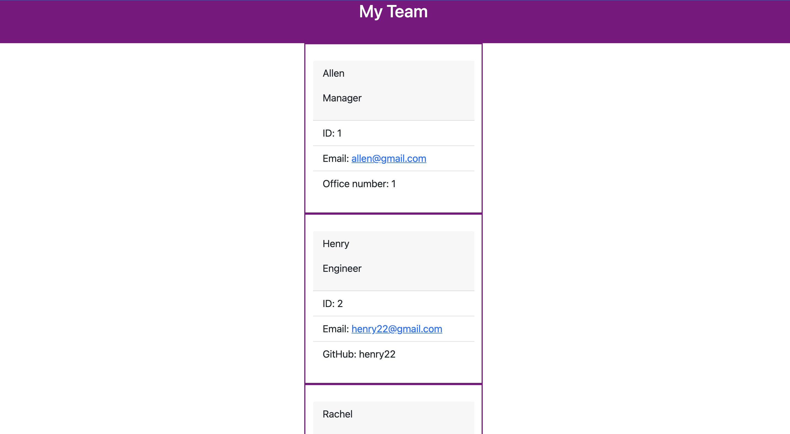

# Team-Profile-Generator-

## Description

- The team profile generator is a great resource for compiling data about a team of developers and displaying the content on a HTML webpage. This app was created with node.js, using the command lines you are then prompted with a series of questions. Based on the answers to the questions a HTML file is created to display the answers from the prompt. This application uses the jest testing framework to confirm that all the written code is deployable with no bugs.

## Installation

- Node.js is needed to run application Install npm using command lines (npm install)

- Jest testing framework is installed by running (npm jest install) in the command lines.

## Usage

To watch app demo please click here [https://loom.com/share/8d4821939c24449c9036698a015370fe]

## Contribution 

- Reggie Tenkorang 

## Test

- 4 test were perfromed

